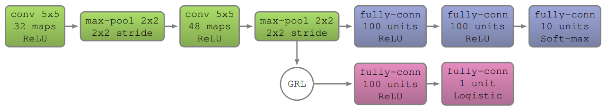

# Unsupervised Domain Adaptation by Backpropagation in Keras

This repository implements the MNIST experiments in [Unsupervised domain adaptation by backpropagation](https://arxiv.org/pdf/1409.7495.pdf). Model and hyperparameters are slightly different from the original ones to achieve the expected results.

You can download MNIST dataset [2] from [here](http://yann.lecun.com/exdb/mnist/), and the already synthetic generated MNIST-M from [here](https://drive.google.com/file/d/0B9Z4d7lAwbnTNDdNeFlERWRGNVk/view).

## Model

The employed DANN is a forked Convolutional Neural Network (CNN) that predicts the class of input digit. The shared part of the network is a feature extractor consisting of a series of convolutional layers that map the input to a discriminative and domain-invariant feature vector f. Afterwards, the network branches into two separated predictors: a label/class predictor and a domain classifier. The former maps the feature vector f to the probabilities of belonging to each of the 10 classes, and the latter maps it to the domain label (0-source, 1-target).



## Running the code

### Data preparation

The structure of the dataset should look like this:

```
path_to_data/
    train/
		source/
			class_0/
				frame_00000.png
				frame_00001.png
				...
			class_1/
			...
			class_9/
		target/
			class_0/
				frame_00000.png
				frame_00001.png
				...
			class_1/
			class_9/
	test/
```

```source/``` folders contain handwritten digits, and ```target``` folders contain synthetic images of digits that have been created from the source ones.

### Training

```
python train.py [flags]
```

Use ```[flags]``` to set paths to training and validation data, number of epochs, batch size, etc. Check ```common_flags.py``` to see the description of each flag.

Example:

```
python train.py --model_dir models/
--train_dir /home/ana/datasets/mnist/train
--val_dir /home/ana/datasets/mnist/test
--num_epochs 500
--batch_size 32
```
### Evaluation

```
python eval.py [flags]
```

## References

[1] Yaroslav Ganin and Victor Lempitsky. [Unsupervised domain adaptation by backpropagation](https://arxiv.org/pdf/1409.7495.pdf). In ICML, p.325–333, 2015.

[2] Y. LeCun, L. Bottou, Y. Bengio, and P. Haffner. Gradient-based learning applied to document recognition. Proceedings of the IEEE, 86(11):2278-2324, November 1998.
